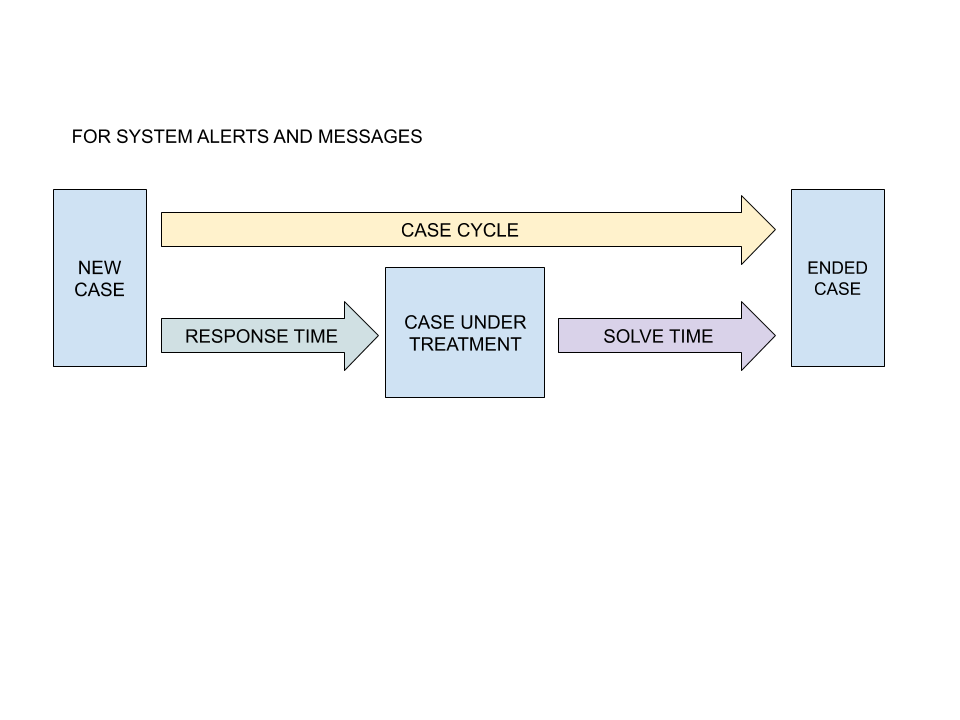
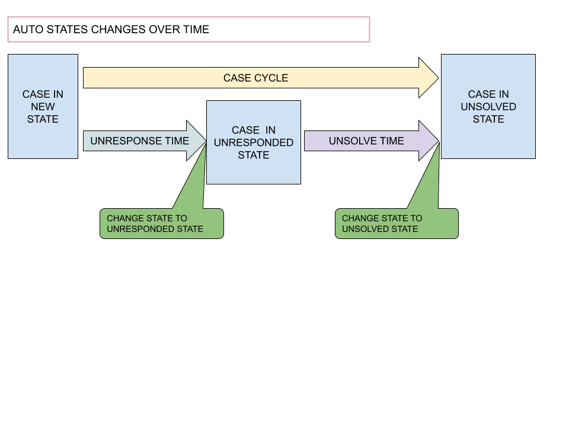
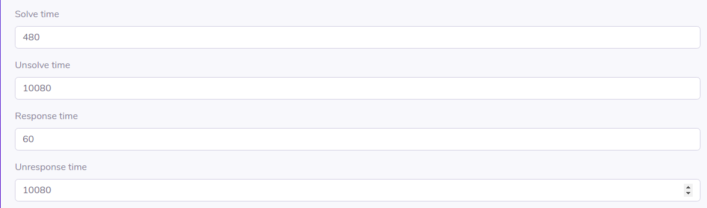
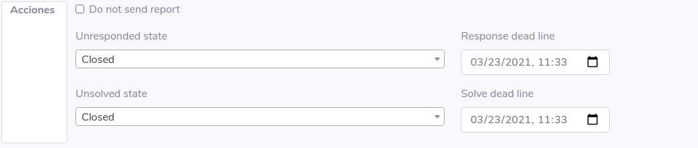

# Estados, cambios y tiempos

## Atributos de tiempos:

* **response time**: es el tiempo expresado en minutos que el sistema sugerirá como máximo para comenzar a atender un caso, es decir pasarlo de un estado de los considerados nuevos a en tratamiento. Se calcula desde el momento en que el incidente fue creado.
* **solve time**: es el tiempo expresado en minutos que el sistema sugerirá como máximo para terminar de atender un incidentes, es decir desde que el caso se registra hasta pasar a un estado cerrado o finalizado. Se calcula desde el momento en que el incidente fue cambiado desde un estado nuevo a estar bajo tratamiento.

Estos dos atributos tienen la función de enviar mensajes al operador del sistema para conocer los tiempos y generar una priorización de los mismos, no siempre el más antiguo es el mas urgente de atender.

## Atributos de tiempo para cambios automáticos de estados

* **unresponse time**: es el tiempo expresado en minutos que el sistema sugerirá como máximo para comenzar a atender un caso, es decir que deja ser de ser nuevo. Al pasar este tiempo el sistema cambiará el estdo del incidente al indicado en **Unresponsed state**.

* **unsolve time**: es el tiempo expresado en minutos que el sistema tomará como límite para cambiar de estado el incidente desde que se comenzó a atender, es decir que dejo ser nuevo. Una vez que se cumpla este tiempo el caso indicado si el incidente sigue sin estar resuelto o cerrado automáticamente cambiara al estado indicado en el atributo **Unsolved State**.

# Aplicación en el sistema

## Aplicados en las decisiones

* En las decisiones se pueden setear los estados a cambiar una vez que se cumplen los tiempos, estos son **Unresponsed state** y **Unsolved State**

## Configurados desde las prioridades

* En las prioridades se pueden definir los tiempos que se aplican a los 4 atributos mencionados antes para los tiempos, estos valores se definen aquí y no a nivel de tipo de caso ya que la definición de prioridaes es global independientemente de las particularidades del caso, un defacement catalogado como crítico debería tener tiempos de resolución iguales que un malware catalogado crítico. 
* Una vez que aplica la decisión y cataloga el caso con cierto nivel de prioridad se aplicarán las reglas de configuración de tiempos definidas allí.

## Aplicados a los Casos:

* En la edición del caso el operador puede elegir los valores para configurar todos estos parámetros individualmente para cada caso, con total libertad.

