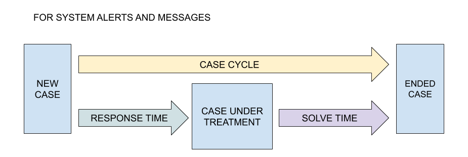
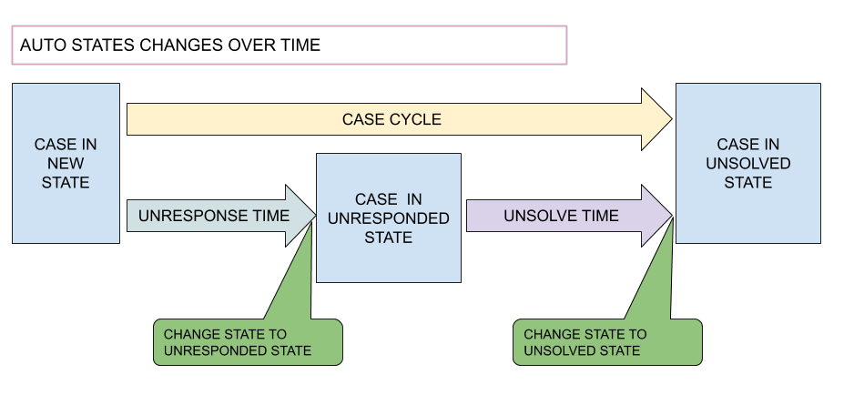

# Decisiones

## Atributos de tiempos:

* **response time**: es el tiempo expresado en minutos que el sistema sugerirá como máximo para comenzar a atender un caso, es decir pasarlo de un estado de los considerados nuevos a en tratamiento. Se calcula desde el momento en que el incidente fue creado.
* **solve time**: es el tiempo expresado en minutos que el sistema sugerirá como máximo para terminar de atender un incidentes, es decir desde que el caso se registra hasta pasar a un estado cerrado o finalizado. Se calcula desde el momento en que el incidente fue cambiado desde un estado nuevo a estar bajo tratamiento.

Estos dos atributos tienen la función de enviar mensajes al operador del sistema para conocer los tiempos y generar una priorización de los mismos, no siempre el más antiguo es el mas urgente de atender.

## Atributos de tiempo para cambios automáticos de estados

* **unresponse time**: es el tiempo expresado en minutos que el sistema sugerirá como máximo para comenzar a atender un caso, es decir que deja ser de ser nuevo. Al pasar este tiempo el sistema cambiará el estdo del incidente al indicado en Unresponsed state.

* **unsolve time**: es el tiempo expresado en minutos que el sistema tomará como límite para cambiar de estado el incidente desde que se comenzó a atender, es decir que dejo ser nuevo. Una vez que se cumpla este tiempo el caso indicado si el incidente sigue sin estar resuelto o cerrado automáticamente cambiara al estado indicado en según Unsolved State.

## Aplicados a los Casos:

* 

# Estados: