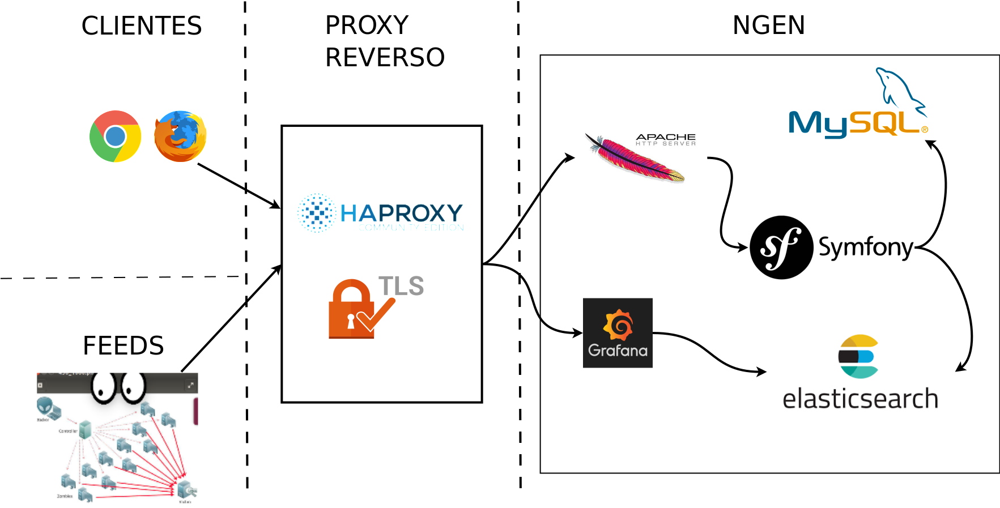

# NGEN

## ¿Qué es?

* El CERTUNLP, es el CSIRT de la Universidad Nacional de La Plata y  fue constituido en el año 2008, desde ese momento hemos pasado por diversas opciones como son GLPI, RT, RITR, Redmine, MantisBT e incluso un primer intento de desarrollo propio en PHP plano, hasta llegar al actual desarrollo de NGEN, el cuál utilizamos en el misión diaria de la gestión de incidentes.

* Si bien CERTUNLP Ngen nace como un sistema de gestión de incidentes desarrollado para su uso en el ámbito de trabajo del CSIRT de la Universidad fue liberado posteriormente como software libre.

## ¿Para qué sirve?

* Mediante una interfaz web nos permite gestionar los incidentes de seguridad informática que afectan a nuestra constituency. 

* Facilita la tarea diaria automatizando mucha de las  tareas que antes hacíamos en forma manual.

* Se relaciona de manera automática con varias fuentes (o feeds) que alimentan al sistema reportandole incidentes, a partir de allí NGEN se encarga de resgistrar el incidente y comunicarse con el o los afectados.

* Al reportar cada incidente brinda a los afectados documentación que les permita comprender el problema y sugiere mecanismos de solución.

## Componentes

 * **Clientes**: Cualquier navegador moderno que soporte los últimos protocolos de HTTPS puede utilizarse para trabajar en NGEN.
 * **Proxy Reverso**: es un componente opcional pero recomedable ya que facilita la definición de filtros de acceso y el manejo de certificados. 
 * **NGEN**: es una aplicación desarrollada en PHP utilizando el framework Symfony 2.8, se conecta con dos motores de bases de datos, una relacional sobre MySQL/MariaDB y otro motor de búsqueda RESTfull en Elasticsearch. Provee tres mecanismos de acceso, via su propia interfaz web para los usuarios humanos, vía un API para los feeds y vía Grafana para la gestión de los tableros de control. 
 * **FEEDS**: los feeds son mecanismos por los cuales se ingresan incidentes en NGEN, utilizando la API cada uno de ellos trasnforma la detección de un incidente en uno registrado en NGEN. Algunos ejemplos son tan complicado como BRO IDS y otros tan simples como la recepción de un reporte externo. 

## ¿Y la automatización?

