# NGEN

## Introduction

NGEN is an open source security incident response system. It is integrable with several information feeds that provides you cyber security intelligence.

The incident handling in NGEN is carried out by the NGEN users (CSIRT members). NGEN has information about our constituency or target community (Areas or departments / IP Networks / Network Administrators).

In ngen we can configure:
* *incidents types*, *reports* and *states*.
* Information feeds about cyber security intelligence.
* Priorities: an importance given to the incident type.
* Decisions: default actions taken for an specific incident type comming from an specific information feed.

## Initial Configuration

To start operating with NGEN it is necessary to define the users that will use NGEN. The NGEN users are CSIRT members. Then, it is equally important, to define our constituency or target community.

To start operation log in to NGEN using default credentials (admin / admin).

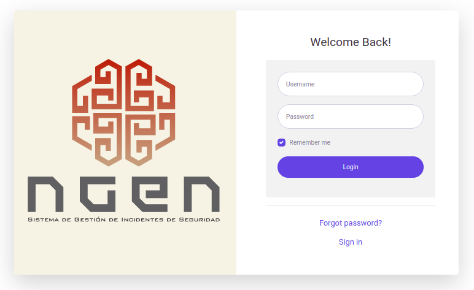

**Please do not continue without first changing the password.**

### Adding Users

To add a user, in **Settings** -> **Users** you will see all NGEN users. Click on **(+)addUser** to define a new user, filling the information requiered in the formulary:

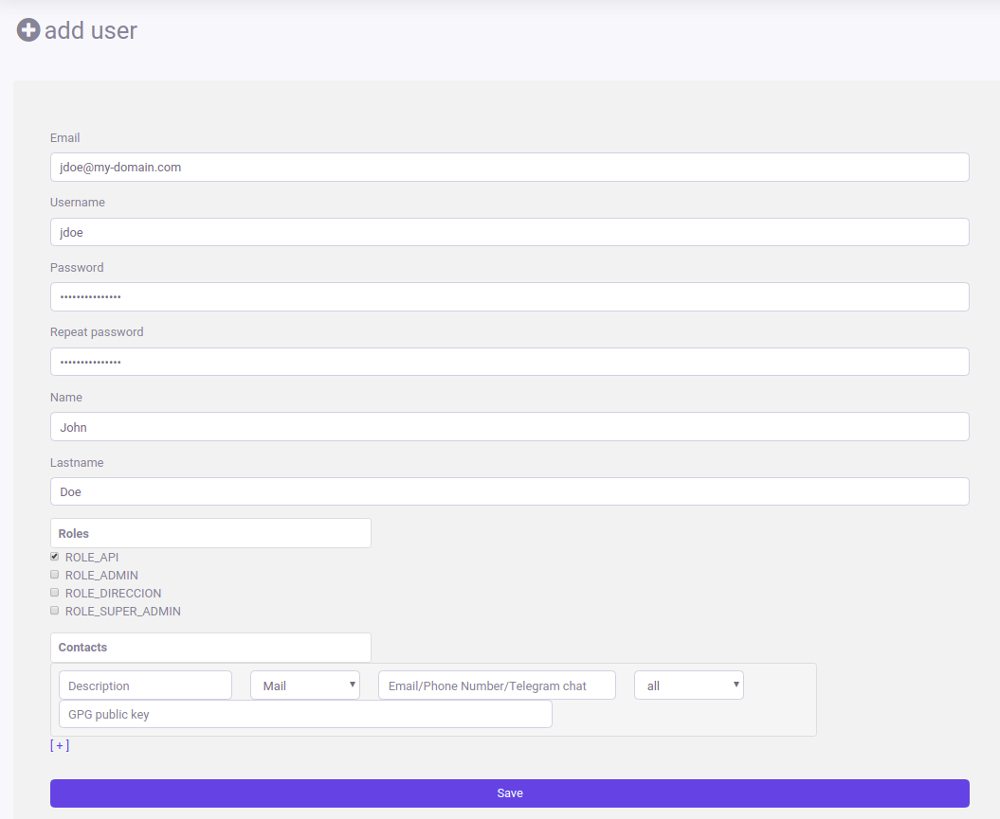
 
The user will receive an email with an activation link. After clicking that link, the user can log in using their credentials.

### Constituency

A constituency is the CSIRT's customer base or recipients of the incident response services.

In NGEN, to define your constituency, you need to define: 
* Network entities: parts of the organization or all the organization.
* Network admins: contact information for differents network entities.
* Networks: different elements that can be used to identify a part or an area of your organization:
  * IPv4 block or host
  * IPv6 block or host
  * DNS domain

### Define your constituency

To define your constituency you will have to create, one or more, *network entities*, *network admins* and *networks*, clicking on **Community** in the left bar:

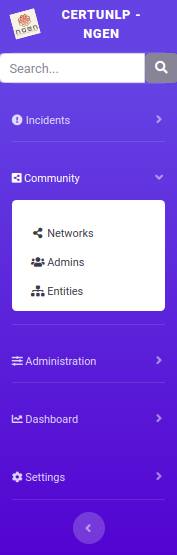

* First, add a new entity clicking on **Entities** in the left side bar to see the entities created and then click on **(+)add Network Entity** to create a new one:

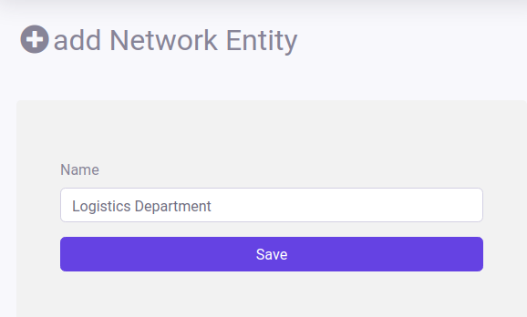

* Then, add the contact information of a new admin clicking on **Admins** in the left side bar to see defined network admins and then click on **(+)add Admin** to create a new one:

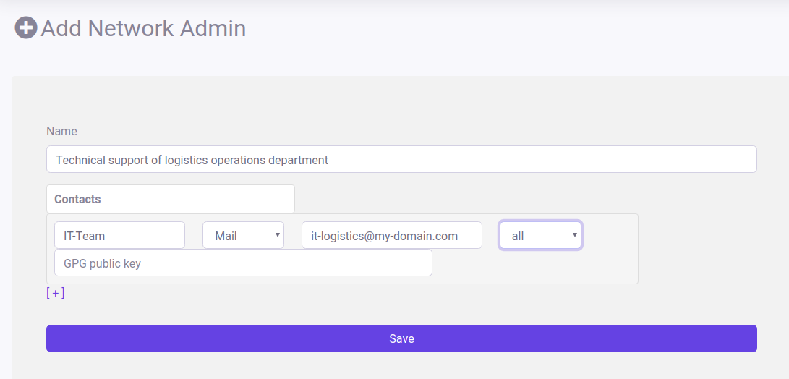

* Finally, add information about a network segment or domain clicking on **Networks** in the left side bar to see the networks created and then click on **(+)add Network** to create a new one. You must assign a previousy created *entity* and *admin*:

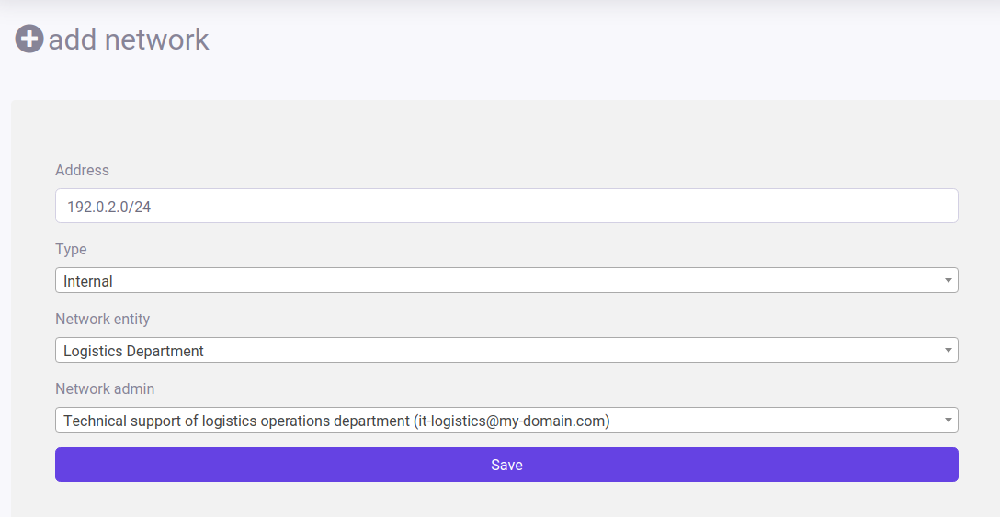

The **Type Internal** means that this network is part of your defined constituency. **External** contacts can be defined statically or can be learned dinamically using **RDAP**.

## Basic Incident Handling

An incident can be created in NGEN in different ways:
* an operator can create it manually
* Depending on the information feed, NGEN can be informed and the incident is created automatically

Each time an incident is created, the user who creates it or the feed that reports it will be the *"reporter"*. The incident can also have *assigned* an operator that will be responsible of the incident treatment.

#### Create a new incident

When reporting an incident we must know:
* The **type** of the incident (spam, pishing, malware, scan, etc)
* The origin of the problem. This probably will be a resource of you *constituency*
   * IPv4
   * IPv6
   * DNS Domain
   
Next you can add more details, for example notes o evidence files, but with these two inputs NGEN can make some configurable **decisions**. These **decisions** will auto-populate some default behavior.

To add a new incident, you first will have to open the incidents view clicking on **Incidents** -> **Incidents** in the left bar:

Then, you can report a new incident clicking on **(+)add Incident**:

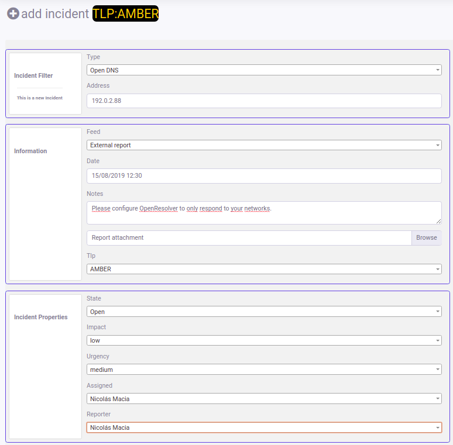

In this case, the **Feed** is completed with the source from where the information was taken: **External report**.

After the creation, an email is sent to report the incident to the network operator defined as the contact administrator for the network where the incident is in. The email sent looks like:

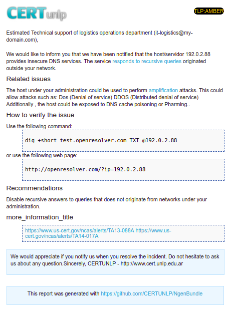

#### Incident inspection & treatment

You can see all the details of the incidents created in a summary manner. 

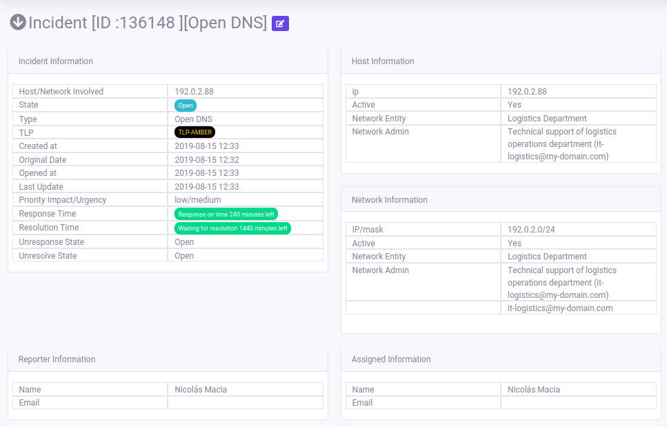

In the same view, you can see:
* different detections of the same problem received by same or different feeds.
* historical changes in the state of the incident while treatment is carried out.
* A place where operators can store comments of related information in the incident treatment. Also, it is posible to report some of these comments to the contact admin by posting a comment and selecting the **Notify to admin** option:

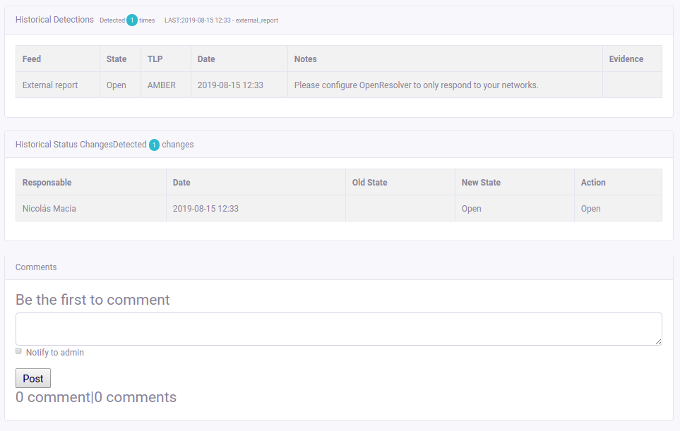

Finally, you can use the main incident interface to view the list of incidents registered:

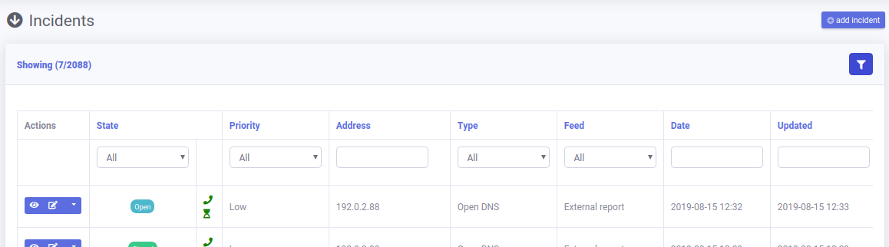

On the left of every incident you have buttons to access to:
* the inspection page
* the edit page
* direct access for change incident state.

## Searchs
### General Search

You can search in any screen of Ngen using the search box at the top left.

### How to use it

Ngen uses context for searchs at input 'search' box. For example, if you are in networks list, the search is going to be applied to find a Network in the system.
  * You can search using simple/keyword search, you just enter any term and press search, Ngen will try to match anything in his indexes with this term. i.e search 'spam'.

  * You can write your own elastic specific search using the indexes. Take a look at the Section Elastic Indexes. i.e you can search for incidents in your own constituency using search 'network.discr:"internal"'.

  
### Specific Filters
 
 * In incidents list you can access to pre-writed filters plus the search box. i.e filter incidets that feed is 'external report'.

* In the way it works the differents terms and filters you enter are going to be aggregated as 'and' clause. i.e search 'spam' in input box and state 'undefined' in column filter.

### Advanced Search
 
 * Take a look at [Resosurces/config/elastica_config.yml](https://github.com/CERTUNLP/NgenBundle/blob/master/Resources/config/elastica_config.yml) to see all the parameters you can use.
 * As example you can search an Elastic query like 'network.discr:"internal" && vnc' with filters feed 'Shadowserver' and state 'staging'.

 
